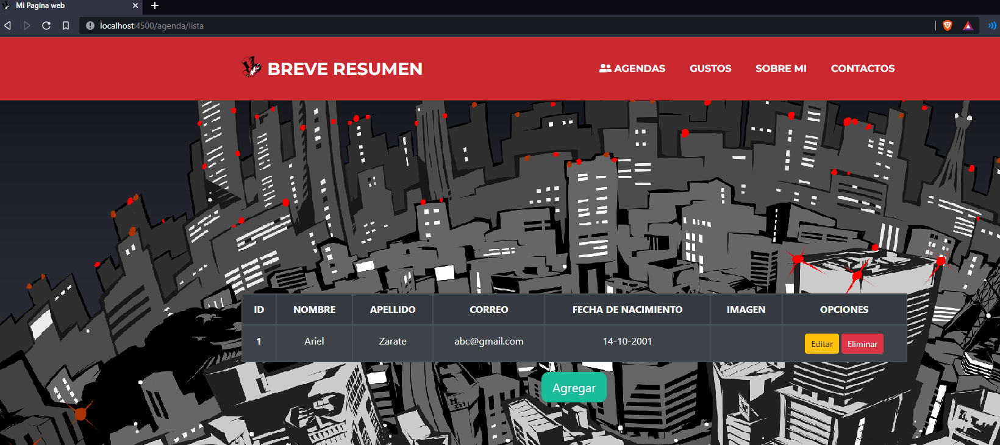

# NODEJS + MYSQL 

> Este proyecto consta de 2 paginas en NodeJS, uno siendo un index y el Otro un CRUD de agenda usando MYSQL

## INSTALACIÓN

```bash
# Instalamos las dependencias para este proyecto
npm install

# En la linea de comandos de MYSQL creamos una base de datos y la usamos
CREATE DATABASE agenda;
USE agenda;
# Luego creamos la tabla
CREATE TABLE agenda (
    id int NOT NULL PRIMARY KEY,
    nombre varchar(255),
    apellido varchar(255),
    correo varchar(255),
    fecha_nac varchar(255),
    imagen varchar(255));
# Y finalmente agregamos un dato a esta tabla
INSERT INTO agenda (id, nombre, apellido, correo, fecha_nac)
    VALUES (1,'Ariel', 'Zarate' ,'abc@gmail.com','14-10-2001');
```

```bash
# Iniciamos este proyecto con:
npm run dev
```
> La pagina se encuentra en: http://localhost:4500/index

## CAPTURAS

> Index


> Crud


